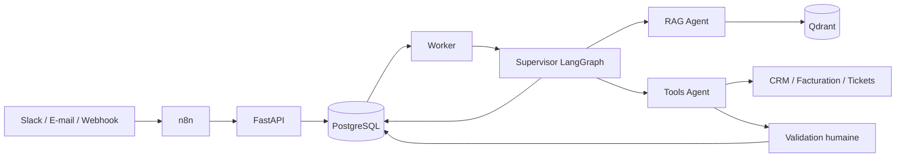

# AssistOps

**Assistant IA multi-agents pour l’automatisation des opérations.**

AssistOps vise à réunir la recherche documentaire et l’exécution d’actions métier
au sein d’une même conversation. À partir d’une demande reçue par webhook, Slack
ou e-mail, il doit retrouver les procédures utiles, consulter les données métier
et demander une validation humaine avant les actions sensibles.

Le projet est développé progressivement autour de trois priorités : fiabilité,
traçabilité et contrôle des accès.

## Cas d’usage

- Retrouver une procédure interne et répondre avec des sources vérifiables.
- Consulter les informations d’un utilisateur ou d’une facture autorisée.
- Proposer un ticket de support, puis le créer après approbation.
- Conserver le contexte d’une demande et reprendre un traitement interrompu.

Exemple de parcours cible : « Comment contester ma facture ? » → recherche de la
procédure → consultation de la facture → proposition de ticket → validation humaine.

## Architecture



Cette architecture décrit la cible du projet. n8n prend en charge les connecteurs
et l’enrichissement des événements ; FastAPI vérifie et persiste les demandes ;
LangGraph orchestre les agents. PostgreSQL porte les événements et les états de
traitement, tandis que Qdrant sert à la recherche documentaire.

## Fonctionnalités

| Domaine | Capacité | Disponibilité |
| --- | --- | --- |
| Réception | Webhooks HMAC-SHA256, contrôle des identités, validation des entrées | Implémenté |
| Fiabilité | Persistance transactionnelle, idempotence et audit de réception | Implémenté |
| Observabilité | Logs JSON, correlation IDs, contrôles de santé | Implémenté |
| Développement | Docker Compose, migrations, tests et workflow GitHub Actions | Implémenté |
| Traitement | Worker, retries, reprise après interruption et statut authentifié | Implémenté, modes démo et RAG |
| Orchestration | Supervisor LangGraph et Tools Agent | Prévu |
| Réponses | RAG Agent, citations vérifiées, abstention et quota persistant | Implémenté |
| Connaissances | Corpus synthétique réaliste, provenance et questions de référence | Disponible |
| Recherche | Ingestion OpenAI, recherche Qdrant filtrée et passages sourcés | Implémenté en CLI |
| Actions | Outils CRM/facturation/tickets et approbations humaines | Prévu |
| Mémoire | Conversations persistées entre sessions | Prévu |
| Intégrations | n8n, Slack, e-mail et API métier réelles | Prévu |
| Évaluation | Recall documentaire, tokens/coût estimé et latence RAG | Implémenté |
| Tracing | LangSmith et E2E métier complets | Prévu |

Le worker propose un mode de démonstration et un mode RAG qui répond aux questions
documentaires avec des citations vérifiées. Les résultats sont conservés dans
PostgreSQL et consultables avec l'identité signée d'origine. Le RAG n'exécute
pas encore d'action métier. Voir le [guide du RAG Agent](docs/rag-agent.md).

## Stack technique

**Socle :** Python · FastAPI · OpenAI · PostgreSQL · Qdrant · Docker · pytest · structlog · GitHub Actions.

**Intégrations prévues :** LangGraph · LangChain · n8n · LangSmith.

## Démarrage rapide

Prérequis : Docker avec Docker Compose. Depuis la racine du dépôt :

```shell
docker compose up --build --wait
```

Compose démarre PostgreSQL et Qdrant, applique les migrations puis lance l’API et le worker.

- Documentation interactive : [localhost:8000/docs](http://localhost:8000/docs)
- Disponibilité des dépendances : [localhost:8000/health/ready](http://localhost:8000/health/ready)
- Disponibilité de l’API : [localhost:8000/health/live](http://localhost:8000/health/live)

Cet environnement utilise des identifiants publics de démonstration et des ports
limités à la machine locale. Il est destiné au développement.

Pour arrêter les services en conservant les données :

```shell
docker compose down
```

Le [guide de développement](docs/development.md) détaille l’installation Python,
la configuration, l’envoi d’un webhook signé et l’exécution des tests.

## Qualité et sécurité

Les tests couvrent l’authentification des webhooks, les entrées invalides,
l’isolation des identités, l’idempotence concurrente et les transactions PostgreSQL,
ainsi que les reprises après expiration, les retries et le rejet des résultats obsolètes.
Le workflow CI inclut les contrôles de code, les tests et une vérification HTTP
sur la stack conteneurisée.

Les signatures et corps de requête ne sont pas journalisés. Les secrets sont
fournis par configuration ; `.env` est exclu de Git et des images Docker.
Le rate limiting, les politiques de rétention, la rotation des secrets et les
contrôles métier complémentaires font partie des travaux de préparation à la production.

La recherche obtient un Recall@5 documentaire de **96,875 %** sur les 16 questions
répondables du petit corpus synthétique de référence. Ce résultat ne mesure ni
la qualité de réponses générées ni une performance générale en production.
Les scénarios E2E métier restent à implémenter. Voir le [rapport](retrieval-reports/baseline.json)
et le [guide de recherche](docs/retrieval.md).

Le parcours RAG est également vérifié sur trois cas réels : réponse sourcée,
information absente et demande hors droits. Les [résultats](retrieval-reports/rag-smoke.json)
sont des contrôles ponctuels sur données synthétiques, pas un benchmark de production.

Le corpus de démonstration est **100 % synthétique** : politiques, FAQ et procédures
originales pour une entreprise fictive, avec versions et droits d'accès explicites.
Il ne contient aucun document réel importé ni aucune donnée client. Les questions
et réponses de référence sont séparées des documents de recherche pour éviter de
fausser l'évaluation. Voir le [guide du corpus](docs/synthetic-corpus.md).

## Documentation

- [RAG Agent : réponses sourcées, configuration et limites](docs/rag-agent.md)
- [Recherche documentaire : fonctionnement, coût et commandes](docs/retrieval.md)
- [Guide de développement et de vérification](docs/development.md)
- [Corpus synthétique : démarche, lecture et évaluation](docs/synthetic-corpus.md)
- [Inventaire et provenance des données](data/README.md)
- [Contrat du MVP et critères d’acceptation](docs/mvp.md)

## Organisation du dépôt

```text
src/assistops/       API, sécurité des webhooks, persistance et observabilité
src/assistops/migrations/
                    Migrations SQL versionnées
scripts/            Démonstrations et vérifications locales
data/               Documents synthétiques et jeux de référence séparés
tests/              Tests unitaires et d’intégration
docs/               Guides de développement, corpus, RAG et périmètre fonctionnel
.github/workflows/  Intégration continue
```
