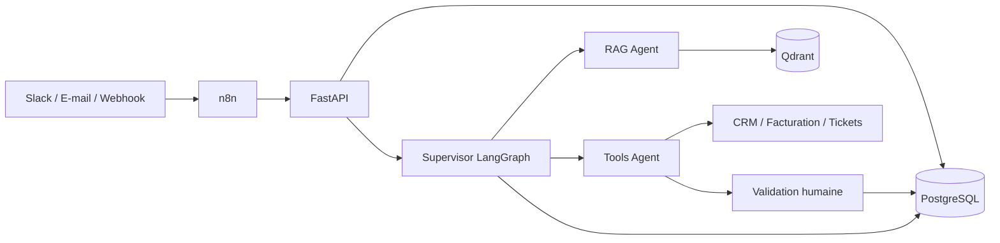

# AssistOps

**Assistant IA multi-agents pour l’automatisation des opérations.**

AssistOps vise à réunir la recherche documentaire et l’exécution d’actions métier
au sein d’une même conversation. À partir d’une demande reçue par webhook, Slack
ou e-mail, il doit retrouver les procédures utiles, consulter les données métier
et demander une validation humaine avant les actions sensibles.

Le projet est développé progressivement autour de trois priorités : fiabilité,
traçabilité et contrôle des accès.

## Cas d’usage

- Retrouver une procédure interne et répondre avec des sources vérifiables.
- Consulter les informations d’un utilisateur ou d’une facture autorisée.
- Proposer un ticket de support, puis le créer après approbation.
- Conserver le contexte d’une demande et reprendre un traitement interrompu.

Exemple de parcours cible : « Comment contester ma facture ? » → recherche de la
procédure → consultation de la facture → proposition de ticket → validation humaine.

## Architecture



Cette architecture décrit la cible du projet. n8n prend en charge les connecteurs
et l’enrichissement des événements ; FastAPI vérifie et persiste les demandes ;
LangGraph orchestre les agents. PostgreSQL porte les événements et les états de
traitement, tandis que Qdrant sert à la recherche documentaire.

## Fonctionnalités

| Domaine | Capacité | Disponibilité |
| --- | --- | --- |
| Réception | Webhooks HMAC-SHA256, contrôle des identités, validation des entrées | Implémenté |
| Fiabilité | Persistance transactionnelle, idempotence et audit de réception | Implémenté |
| Observabilité | Logs JSON, correlation IDs, contrôles de santé | Implémenté |
| Développement | Docker Compose, migrations, tests et workflow GitHub Actions | Implémenté |
| Traitement | Worker, retries et reprise des travaux interrompus | Prévu |
| Orchestration | Supervisor LangGraph, RAG Agent et Tools Agent | Prévu |
| Recherche | Ingestion, embeddings, recherche Qdrant et citations | Prévu |
| Actions | Outils CRM/facturation/tickets et approbations humaines | Prévu |
| Mémoire | Conversations persistées entre sessions | Prévu |
| Intégrations | n8n, Slack, e-mail et API métier réelles | Prévu |
| Évaluation | LangSmith, latence/tokens/coût, évaluation RAG et E2E métier | Prévu |

Les événements acceptés sont actuellement conservés en attente dans PostgreSQL.
Leur réception ne déclenche pas encore d’agent ni d’action métier.

## Stack technique

**Socle :** Python · FastAPI · PostgreSQL · Qdrant · Docker · pytest · structlog · GitHub Actions.

**Intégrations prévues :** LangGraph · LangChain · OpenAI · n8n · LangSmith.

## Démarrage rapide

Prérequis : Docker avec Docker Compose. Depuis la racine du dépôt :

```shell
docker compose up --build --wait
```

Compose démarre PostgreSQL et Qdrant, applique les migrations puis lance l’API.

- Documentation interactive : [localhost:8000/docs](http://localhost:8000/docs)
- Disponibilité des dépendances : [localhost:8000/health/ready](http://localhost:8000/health/ready)
- Disponibilité de l’API : [localhost:8000/health/live](http://localhost:8000/health/live)

Cet environnement utilise des identifiants publics de démonstration et des ports
limités à la machine locale. Il est destiné au développement.

Pour arrêter les services en conservant les données :

```shell
docker compose down
```

Le [guide de développement](docs/development.md) détaille l’installation Python,
la configuration, l’envoi d’un webhook signé et l’exécution des tests.

## Qualité et sécurité

Les tests couvrent l’authentification des webhooks, les entrées invalides,
l’isolation des identités, l’idempotence concurrente et les transactions PostgreSQL.
Le workflow CI inclut les contrôles de code, les tests et une vérification HTTP
sur la stack conteneurisée.

Les signatures et corps de requête ne sont pas journalisés. Les secrets sont
fournis par configuration ; `.env` est exclu de Git et des images Docker.
Le rate limiting, les politiques de rétention, la rotation des secrets et les
contrôles métier complémentaires font partie des travaux de préparation à la production.

Les objectifs de Recall@5 et les scénarios E2E métier seront évalués sur des jeux
versionnés. Aucun score de performance non mesuré n’est présenté comme résultat acquis.

## Documentation

- [Guide de développement et de vérification](docs/development.md)
- [Contrat du MVP et critères d’acceptation](docs/mvp.md)
- [Architecture et responsabilités](docs/adr/0001-mvp.md)
- [Réception durable : garanties et limites](docs/adr/0002-durable-ingress.md)

## Organisation du dépôt

```text
src/assistops/       API, sécurité des webhooks, persistance et observabilité
src/assistops/migrations/
                    Migrations SQL versionnées
scripts/            Démonstrations et vérifications locales
tests/              Tests unitaires et d’intégration
docs/               Guides, contrat fonctionnel et décisions d’architecture
.github/workflows/  Intégration continue
```
